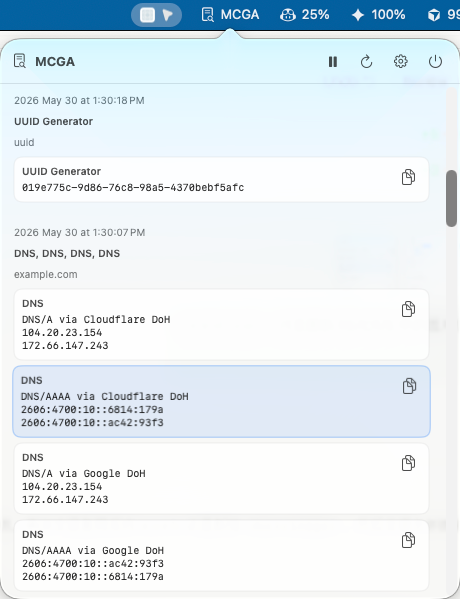
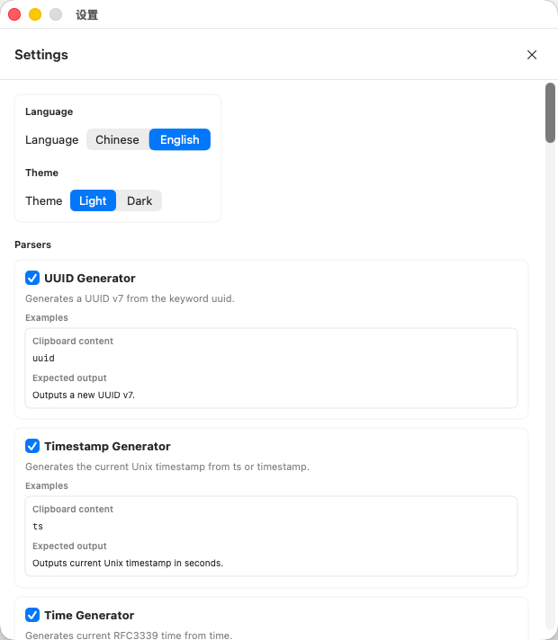

# MCGA - My Clipboard Guard Assistant

macOS menu bar clipboard parser. MCGA watches the clipboard, runs built-in and custom parsers, then shows parsed results in a popover and an auto popup.

## Features

- macOS 15+ menu bar app, no Dock icon.
- Clipboard auto-detection with hover-preserved popup.
- Current result and history in the menu bar popover.
- Copy parsed result content without copying parser titles.
- Parser settings window with Chinese / English UI, light / dark theme, and per-parser toggles.
- Built-in parsers for UUID, ObjectID, hash, CIDR, IPv4/IPv6, timestamp, HTTP status, number base, Cron, URL, JSON, JSON5, XML, TOML, YAML, HTML entity, Base64, DNS, and keyword generators.
- Custom command parsers from local scripts.

## Screenshots

### Popover



### Settings



## Installation

Download the latest DMG from the [Releases](https://github.com/jimyag/mcga/releases) page. Open the DMG and drag `MCGA.app` to your `Applications` folder.

**Note:** Because MCGA is an open-source tool and not signed with an Apple Developer certificate, macOS Gatekeeper may show a warning that the app "is damaged and can't be opened." You must manually remove the quarantine attribute before running it for the first time.

Open `Terminal` and run:

```bash
sudo xattr -rd com.apple.quarantine /Applications/MCGA.app
```

Enter your password when prompted. You can then open MCGA normally from Launchpad or your Applications folder.

## Build

Requirements:

- macOS 15+
- Swift 6 / Xcode Command Line Tools

Verify core parsers:

```bash
swift run MCGASmokeTests
```

Build the executable:

```bash
swift build --product MCGA
```

Package `.build/MCGA.app`:

```bash
bash scripts/build-macos-app.sh
```

Open the app:

```bash
open .build/MCGA.app
```

If an old version is running:

```bash
pkill MCGA
open .build/MCGA.app
```

After launch, click the `MCGA` menu bar item to view current results and history. Copy a supported value such as JSON, UUID, IP, timestamp, CIDR, HTTP status code, URL, HTML entities, XML, TOML, Base64, Cron, YAML, or a domain to trigger parsing.

## Custom Command Parsers

Custom parsers are loaded from:

```text
~/.config/mcga/custom_parsers.json
```

Only command parsers are supported. MCGA executes the configured command, writes the clipboard text to stdin, and reads stdout:

- exit code `0` means success
- empty stdout means no result
- the first stdout line is shown as the parsed value
- multi-line stdout is preserved as result details
- stderr is ignored
- command paths support absolute paths, `~`, `$HOME`, and `${HOME}`
- commands must be executable files
- `timeoutMs` is clamped to 50-3000 ms, default 500 ms

Example:

```json
{
  "parsers": [
    {
      "name": "Demo Command",
      "kind": "command",
      "description": {
        "zh": "执行本地命令解析 demo: 开头的剪切板内容。",
        "en": "Runs a local command for clipboard text starting with demo:."
      },
      "examples": [
        {
          "input": "demo:123",
          "expected": {
            "zh": "命令 stdout 的第一行会显示为解析结果。",
            "en": "The first stdout line is shown as the parsed result."
          }
        }
      ],
      "match": "^demo:",
      "command": "$HOME/.config/mcga/parsers/demo.sh",
      "args": [],
      "timeoutMs": 500,
      "enabled": true
    }
  ]
}
```

Example script:

```bash
#!/usr/bin/env bash
set -euo pipefail
input="$(cat)"
printf 'Parsed %s\n' "$input"
printf 'Original clipboard: %s\n' "$input"
```

## License

MIT
